# TeatherPay

**The African leg of the Africa ↔ Latin America corridor. Naira in Lagos, bolivianos in La Paz, settled on Stellar in under a minute.**

**TeatherPay** is a remittance corridor connecting Nigerian local rails to Pollar's live Bolivian BOB ramp. Pollar runs the Latin American side. This repo is the Nigerian side, plus the orchestration that makes the two halves one payment.

> Built for the Pollar × Stellar hackathon. Runs on Stellar Testnet. Live demo: `<DEMO_URL>` · Video: `<VIDEO_URL>`

---

## The 60-second pitch

There are roughly 200,000 Chinese, Lebanese, Indian and West African traders moving goods between Latin America and West Africa, and a growing Nigerian diaspora across Brazil, Argentina and Bolivia. Money between these two regions travels badly. A Lagos → La Paz transfer today routes NGN → USD → USD correspondent → BOB, touches three intermediaries, takes two to five business days, and loses 7–12% to spread and fees. Below about $200 it isn't worth sending at all.

Neither side is short of local rails. Nigeria has instant inter-bank transfers (NIP) that settle in seconds, and a dense agent network for cash. Bolivia has Pollar's licensed BOB ramp. The missing piece has always been the bridge between them.

TeatherPay makes that bridge a Stellar payment.

- **Sender** funds a unique naira account number from any Nigerian bank app, or hands cash to a local agent.
- **TeatherPay** converts to USDC and moves it on Stellar. Sub-cent fees, ~5 second finality.
- **Pollar's BOB ramp** pays out bolivianos to the recipient in Bolivia.

The sender never sees a wallet address, a seed phrase, a gas fee or a trustline. They see: *"Send ₦150,000 to 8012345678. Ana receives Bs 640 in about 4 minutes."*

**Corridor cost: ~1.8% all-in, vs 7–12% incumbent. Settlement: minutes, not days.**

---

## What we built

| Layer | Status |
|---|---|
| Nigerian on-ramp — dedicated virtual accounts (NIP bank transfer) | Working, provider sandbox |
| Nigerian on-ramp — agent cash-in | Designed, not implemented — see [What's real and what isn't](#whats-real-and-what-isnt) |
| Nigerian off-ramp — bank payout to any NUBAN | Working, provider sandbox |
| Pollar wallets, deferred activation, KYC gate | Working, Stellar Testnet |
| USDC settlement on Stellar with reference memos | Working, Stellar Testnet |
| BOB payout via Pollar off-ramp | Working, run with the Pollar team |
| Idle-float yield on in-transit USDC (Blend / DeFindex) | Working, Stellar Testnet |
| Receipts — on-chain proof per transfer | Working |

See [What's real and what isn't](#whats-real-and-what-isnt) for the honest breakdown.

---

## How money moves

```mermaid
flowchart LR
    subgraph NG["🇳🇬 Nigeria — this repo"]
        A["Sender<br/>bank app or agent"]
        B["Virtual account<br/>NUBAN / NIP"]
        C["TeatherPay backend<br/>order ledger"]
        D["NGN treasury"]
    end

    subgraph STELLAR["⭐ Stellar"]
        E["Sender wallet<br/>Pollar G-address"]
        F["USDC in flight<br/>Blend / DeFindex"]
    end

    subgraph BO["🇧🇴 Bolivia — Pollar"]
        G["Pollar BOB<br/>off-ramp"]
        H["Recipient<br/>bank / cash"]
    end

    A -->|"₦ NIP transfer"| B
    B -->|"webhook"| C
    C -->|"credit order"| D
    D -->|"runTx payment + memo"| E
    E --> F
    F -->|"createOffRamp"| G
    G -->|"Bs payout"| H

    style NG fill:#e1f5ee,stroke:#1d9e75
    style STELLAR fill:#eeedfe,stroke:#7f77dd
    style BO fill:#faeeda,stroke:#ba7517
```



The reverse direction (Bolivia → Nigeria) runs the same machine backwards: Pollar on-ramps BOB to USDC, TeatherPay off-ramps USDC to a Nigerian bank account.

---

## Order lifecycle

Every transfer is one row in `orders`, advanced by a single state machine. No step is inferred from another service's state.

```
QUOTED
  └─ rate locked for 15 min, virtual account issued
AWAITING_NGN
  └─ webhook: funds landed, amount + reference matched
NGN_RECEIVED
  └─ KYC tier checked against corridor limit
KYC_PENDING ──────────┐
  └─ POST /v1/wallets/fund on approval
SETTLING              │
  └─ treasury runTx('payment') → sender wallet, memo = order ref
IN_FLIGHT             │
  └─ optional earnDeposit while awaiting BOB liquidity
OFFRAMP_CREATED       │
  └─ createOffRamp + pollRampTransaction
BOB_PAID              │
  └─ receipt issued, tx hashes recorded
COMPLETE              │
                      ▼
              FAILED → REFUNDED (NGN returned to source account)
```

**Invariants we hold:**

- Every webhook handler is idempotent on the provider's event id. Nigerian payment providers retry aggressively; double-crediting an order is the one bug that costs real money.
- NGN never leaves treasury before it has landed and cleared. On-chain settlement is triggered by a confirmed inbound, never by an optimistic one.
- Every state transition writes an append-only `order_events` row. The receipt shown to the user is generated from that log, not from mutable order fields.
- A failed leg after `SETTLING` refunds in NGN to the originating account, not in USDC. Senders should never be handed crypto they didn't ask for.

---

## Pollar SDK integration

TeatherPay uses Pollar for the entire user-facing path — wallets, KYC, the USDC a sender receives, and the Bolivian payout. No Stellar transaction-building code, key management, or trustline logic touches a user's funds anywhere in this repo.

One deliberate exception: the corridor's own settlement treasury sits outside Pollar's custody on purpose, so `lib/treasury/stellar.ts` does call `@stellar/stellar-sdk` directly (`TransactionBuilder`, `Operation.payment`) to pay a sender's wallet from the reserve. See [why](#why-this-shape) below.

### 1. Onboarding — no crypto surface area

```tsx
// app/components/Onboard.tsx
'use client';
import { usePollar } from '@pollar/react';

export function Onboard() {
  const { isAuthenticated, wallet, login } = usePollar();
  if (isAuthenticated) return <Dashboard address={wallet!.address} />;

  return (
    <button onClick={() => login({ provider: 'email', email })}>
      Continue with email
    </button>
  );
}
```

One call creates the Stellar G-address, encrypts the key in AWS KMS, and enables the USDC trustline. The sender — a trader in Aba who has never heard of Stellar — sees an OTP and then a balance.

### 2. Deferred funding as the compliance gate

This is the feature that made the corridor legally coherent, and it's the reason we chose Pollar over rolling our own.

A remittance operator cannot let an unverified user transact. But Stellar charges an XLM reserve for every account that exists. Immediate funding means paying a reserve for every drive-by signup — and in Nigeria, where signup-to-conversion on financial apps runs low, most of those accounts never send a naira.

Deferred mode creates the G-address on-chain with no reserve. It only activates when our backend calls the funding endpoint, and our backend only calls it when KYC clears.

```ts
// app/api/kyc/approved/route.ts — server only, secret key never reaches the browser
export async function POST(req: NextRequest) {
  const { publicKey, orderId } = await req.json();

  await assertKycApproved(publicKey);           // our own record, not the client's claim
  await assertWithinTierLimit(publicKey, orderId);

  const res = await fetch('https://server.api.pollar.xyz/v1/wallets/fund', {
    method: 'POST',
    headers: {
      'x-pollar-api-key': process.env.POLLAR_SECRET_KEY!,
      'Content-Type': 'application/json',
    },
    body: JSON.stringify({ publicKey }),
  });

  // 409 means already funded — idempotent, treat as success
  if (!res.ok && res.status !== 409) {
    const { code } = await res.json();
    throw new CorridorError('WALLET_ACTIVATION_FAILED', code);
  }

  return NextResponse.json({ activated: true });
}
```

**Cost effect at corridor scale.** With USDC as the only configured asset, a funded wallet locks 1.5 XLM (1 base + 0.5 per trustline) in our funding wallet. At 10,000 signups with 30% completing verification, deferred funding locks ~4,500 XLM instead of ~15,000 — capital that stays available as corridor float instead of sitting dead behind abandoned accounts.

### 3. KYC mapped to Nigerian regulation

Nigeria's central bank uses a three-tier KYC framework, with transaction and balance limits rising as identity evidence deepens. Pollar's KYC levels map onto it directly:

| CBN tier | Evidence | Pollar level | Corridor limit |
|---|---|---|---|
| Tier 1 | Name, phone, photo | `basic` | Low-value, single transfers |
| Tier 2 | + BVN or NIN | `intermediate` | Standard remittance band |
| Tier 3 | + address verification, source of funds | `enhanced` | Trade-scale transfers |

```ts
const providers = await pollar.getKycProviders('NG');
const session = await pollar.startKyc({
  providerId: providers[0].id,
  level: tierForAmount(order.ngnAmount),
  redirectUrl: `${APP_URL}/kyc/callback?order=${order.id}`,
});

const status = await pollar.pollKycStatus(providers[0].id, {
  intervalMs: 4000,
  timeoutMs: 180_000,
});
```

Limits live in `config/corridor-limits.ts`, not in code paths — they move when the regulator moves.

### 4. Settlement with a reference memo

```ts
const outcome = await pollar.runTx(
  'payment',
  { destination: order.senderWallet, amount: order.usdcAmount, asset: USDC },
  { memo: { type: 'text', value: order.reference } },   // e.g. "TEATHERPAY-7K3QX2"
);

if (outcome.status === 'error') {
  await failOrder(order.id, outcome.resultCode, outcome.details);
} else {
  await recordHash(order.id, 'settlement', outcome.hash);
}
```

The memo is what makes a Stellar payment reconcilable against a naira deposit. It's the same field the correspondent banking system uses for remittance references — it just costs a fraction of a cent here.

### 5. BOB payout

```ts
const quotes = await pollar.getRampsQuote({
  country: 'BO',
  currency: 'BOB',
  amount: Number(order.usdcAmount),
  direction: 'offramp',
});
// quotes[0].rail === 'QR' — Bolivia settles over the country's
// interoperable QR standard. quotes are sorted best-first.

const offramp = await pollar.createOffRamp({
  quoteId: quotes[0].quoteId,
  amount: Number(order.usdcAmount),
  currency: 'BOB',
  country: 'BO',
  walletAddress: order.senderWallet,
  fullName: order.beneficiary.fullName,
  fields: order.beneficiary.fields, // from quotes[0].requiredFields — provider-declared, not our schema
});

await recordRampId(order.id, offramp.txId);
const final = await pollar.pollRampTransaction(offramp.txId, {
  intervalMs: 5000,
  timeoutMs: 600_000,
});
```

The poll is a convenience for the demo. In production the ramp status is reconciled by a scheduled worker, because a browser tab closing should never orphan a payout.

### 6. Float yield while in transit

USDC waiting on the Bolivian leg is idle capital. Pollar exposes DeFindex vaults and Blend pools, so it doesn't have to be.

```ts
const providers = await pollar.getEarnProviders();
if (providers.length) {
  const opportunities = await pollar.getEarnOpportunities('blend');
  const [best] = opportunities.sort((a, b) => Number(b.apy) - Number(a.apy));
  await pollar.earnDeposit({ provider: 'blend', opportunity: best.id, amount: order.usdcAmount });
}
```

This is corridor economics, not a garnish. Yield on in-transit float is what lets the corridor quote a tighter spread than an operator whose money sleeps in a correspondent account. Withdrawal is unconditional and precedes off-ramp creation — float yield never delays a payout.

### 7. Receipts

```ts
await pollar.fetchTxHistory({ limit: 20, offset: 0 });
const { records } = pollar.getTxHistoryState().data;
```

Every completed transfer renders a receipt page with the NGN reference, the Stellar hash linked to Stellar Expert, the ramp transaction id, and the BOB amount delivered. A sender can hand it to their recipient, their accountant, or their bank.

---

## The Nigerian leg in detail

This is the part Pollar doesn't provide, and the part the flagship challenge asks for.

### Rail 1 — Dedicated virtual accounts (primary)

Every Nigerian bank app can send to a NUBAN account number, and NIP settles in seconds. So each order gets its own account number from the provider (Paystack, Monnify or Flutterwave all expose this).

- Sender sees a 10-digit account number and a bank name. Nothing else to learn.
- The account number is the reference. No memo typos, no "did you include the code?" support tickets.
- Provider fires a webhook on credit; we match on `(accountNumber, amount, eventId)`.
- Accounts are single-use per order and released after terminal state.

**Why this rail first:** it's the only Nigerian rail where the sender's existing habit — open bank app, paste account number, send — is already the flow. Zero behaviour change is worth more than any feature.

### Rail 2 — Agent cash-in (designed, not built)

For senders without a bank app, or sending cash on behalf of someone else. This is a specification, not running code — no console, no rail adapter exists yet. The design:

1. Sender picks an agent from a list, gets a 6-character order code.
2. Sender hands cash to the agent.
3. Agent confirms receipt in the agent console; the amount is debited from the agent's pre-funded NGN float.
4. Order advances to `NGN_RECEIVED`; agent's float is reconciled against their settlement account daily.

Agents are pre-funded, so TeatherPay's exposure is bounded by float, never by trust. This is the same model OPay and Moniepoint agents run on — it works in Nigeria because it already works in Nigeria.

### Rail 3 — NGN payout (reverse direction)

For Bolivia → Nigeria, the provider's transfer API pays out to any Nigerian bank account. Name-enquiry validates the recipient's account name before the payout is queued, so a mistyped account number fails before the money moves rather than after.

### Treasury and float

The uncomfortable truth of any corridor: someone has to hold naira in Nigeria and USDC on Stellar, and the ratio drifts every day.

- **NGN float** sits with the payment provider, covering outbound naira payouts.
- **USDC float** sits in the Pollar treasury wallet, covering outbound settlement.
- **Rebalancing** is a manual operator action during the hackathon, surfaced as a dashboard alert when either side crosses a threshold. It's a scheduled treasury job in production.
- **Quotes expire in 15 minutes** and carry the spread that covers NGN/USD volatility across that window. Quote expiry is enforced server-side; a stale quote is re-priced, never honoured.

We'd rather show this honestly than pretend a hackathon demo has solved corridor liquidity.

---

## Running it

**Requirements:** Node 20+, a Pollar app on Testnet, a payment-provider sandbox account.

```bash
git clone <REPO_URL>
cd teatherpay
npm install
cp .env.example .env.local
```

Fill in `.env.local` — the Pollar keys and `USDC_ISSUER` from the dashboard, then:

```bash
npm run setup:treasury   # generates and funds a testnet treasury keypair, prints the seed to add
npm run dev
```

The full set of variables (see `.env.example` for the current, authoritative version):

```bash
# .env.local
NEXT_PUBLIC_POLLAR_PUBLISHABLE_KEY=pub_testnet_xxxxxxxxxxxx
POLLAR_SECRET_KEY=sec_testnet_xxxxxxxxxxxx      # server only — never NEXT_PUBLIC_

STELLAR_NETWORK=testnet
USDC_ISSUER=GBBD47IF6LWK7P7MDEVSCWR7DPUWV3NY3DTQEVFL4NAT4AQH3ZLLFLA5
TREASURY_SECRET_SEED=                           # leave blank — setup:treasury fills this in
SETTLEMENT_LOW_WATER=250

NGN_RAIL=sandbox                                # sandbox | paystack
NGN_PROVIDER_SECRET_KEY=sk_test_xxxxxxxxxxxx
NGN_PROVIDER_WEBHOOK_SECRET=sandbox-webhook-secret
NGN_PREFERRED_BANK=wema-bank

NGN_PER_USD_FIXED=1550                          # fixed rate, reproducible demos — remove for the live feed
DEMO_ASSUMED_TIER=basic
```

**Pollar dashboard setup:**

1. **Build → API Keys** — generate `pub_testnet_` and `sec_testnet_`.
2. **Build → Domains** — add `http://localhost:3000` and your deploy origin, or the SDK is blocked by origin policy.
3. **Treasury → Tokens & Trustlines** — enable USDC only. Each extra asset adds 0.5 XLM to every wallet's reserve.
4. **Treasury → Funding Mode** — set **Deferred**.
5. **Treasury → Account Funding** — fund the funding wallet. Budget `activations × 1.5 XLM`.
6. **Treasury → Earn** — enable Blend and/or DeFindex if you want the float leg.
7. **Integrations → Ramps** — configure the BOB ramp with the Pollar team.

**Local webhooks:** Nigerian providers can't reach `localhost`. Use `npx ngrok http 3000` and register the tunnel URL as the webhook endpoint.

> Testnet API keys are capped at 1,000 requests per day. Our ramp and KYC pollers use 4–5 second intervals with exponential backoff for exactly this reason — a naive 1-second poll burns the daily budget in under twenty minutes.

---

## Proof of real usage

Every row below is a real transfer executed end to end. Hashes are verifiable on Stellar Expert without taking our word for anything.

| # | Date | NGN in | USDC settled | BOB out | Stellar hash | Ramp tx |
|---|---|---|---|---|---|---|
| 1 | `<DATE>` | ₦`<AMT>` | `<AMT>` | Bs `<AMT>` | [`<HASH>`](https://stellar.expert/explorer/testnet/tx/<HASH>) | `<RAMP_ID>` |
| 2 | | | | | | |
| 3 | | | | | | |

**Corridor timings observed:** NGN credit to webhook `<X>s` · webhook to Stellar confirmation `<X>s` · Stellar to BOB payout `<X>m`.

**Treasury wallet:** [`<G_ADDRESS>`](https://stellar.expert/explorer/testnet/account/<G_ADDRESS>)

---

## What's real and what isn't

Judges see a lot of demos that blur this line. We'd rather draw it ourselves.

**Real:**
- Stellar Testnet settlement. Every hash above is a real on-chain transaction.
- The full Pollar integration — wallets, deferred activation, KYC, ramp calls, Earn, history. No mocked SDK.
- The order state machine, idempotency, refund path and reconciliation logic. This is production-shaped code.
- BOB payout, executed with the Pollar team on their live ramp.

**Sandbox:**
- The Nigerian provider is in test mode, so naira movements are sandbox credits against sandbox accounts. The integration is the real API with real webhook signatures — only the money is test money. Going live is a key swap and a compliance review, not a rewrite.

**Semi-manual:**
- Treasury rebalancing is a dashboard alert and an operator action.

**Not built:**
- Agent cash-in (Rail 2). The flow described above is a specification, not running code — no console, no rail adapter. The Nigerian leg in currently runs on Rail 1 (virtual accounts) alone.
- A licence. A Nigerian remittance operator needs CBN authorisation, or a partnership with a licensed IMTO. TeatherPay is designed to slot behind one, not to pretend it doesn't need one.
- Sanctions screening beyond the KYC provider's own checks.
- Production NDPA data-residency posture for Nigerian personal data.

---

## Why this shape

**Why custodial G-addresses instead of passkey smart wallets.** Passkey C-addresses are the better long-term story — genuinely non-custodial, hardware-bound. But Swap, Earn and manual trustlines aren't supported for smart wallets yet, and Earn is load-bearing for our float economics. It's also browser-only, while most of our senders are on a phone. We chose the account type that lets the corridor actually work, and we'll revisit when the feature gap closes.

**Why the treasury writes its own Stellar transactions instead of using a Pollar wallet.** Pollar custodies *user* wallets, which is exactly right for users. Corridor float is the operator's own money and belongs in the operator's own account, under the operator's own key — not behind a login session. So `lib/treasury/stellar.ts` is a plain Stellar keypair calling `@stellar/stellar-sdk` directly. It's the one piece of this codebase that isn't Pollar, and that's on purpose, not an oversight.

**Why orders are a JSON file, not a database.** `lib/orders/store.ts` reads and writes `.data/orders.json` — no Postgres, no ORM, nothing to provision. The whole repo runs from `npm install && npm run dev` with nothing else, which matters more for a five-day build a judge might actually run than a database would. The store is written behind the same interface a real database would sit behind (`getOrder`, `advance`, `claimEvent`, …), so swapping it is a change to two functions, not to anything that calls them.

**Why USDC and not a naira stablecoin.** cNGN exists, and a direct NGN-stable → BOB path would be shorter. But USDC has the deepest Stellar liquidity and is what Pollar's BOB ramp prices against. One less thin market between the sender and the recipient.

**Why memos over a database-only reference.** The reference survives on-chain. If TeatherPay disappears tomorrow, the sender can still prove what they sent and when, from a public ledger, with no cooperation from us. Remittance users have been burned by operators before.

**Why deferred funding is the whole architecture, not a cost optimisation.** It collapses "verify the user" and "activate the account" into one gate controlled entirely by our backend. There is no code path where an unverified user has a transactable wallet. That property is hard to retrofit and easy to get right from the start.

---

## What's next

- Second African leg — Ghana (mobile money) and Kenya (M-Pesa) reuse the entire order machine; only the rail adapter changes.
- Recurring transfers for trade counterparties who settle on the same cycle every month.
- x402 agent payments — a purchasing agent that settles supplier invoices across the corridor without a human in the loop.
- Partnership route with a licensed IMTO for the Nigerian side.

---

## Repo layout

```
teatherpay/
├── app/
│   ├── layout.tsx                     # PollarProvider + Pollar's own stylesheet
│   ├── page.tsx                       # the send flow: amount → sign-in → account number → payout → receipt
│   ├── globals.css                    # corridor design tokens
│   ├── operator/page.tsx              # treasury health, order queue, reserve float, ramp-country check
│   ├── receipt/[id]/page.tsx          # on-chain receipt, built from the order's event log
│   ├── components/
│   │   ├── Rail.tsx                   # the Lagos ↔ La Paz status rail
│   │   ├── PayoutPanel.tsx            # Bolivian leg — quote, provider-declared beneficiary form, off-ramp
│   │   ├── OrderQueue.tsx             # operator's live order list
│   │   ├── OperatorFloat.tsx          # reserve wallet — Earn deposit/withdraw, settlement top-up
│   │   ├── RampStatus.tsx             # which countries this app's ramp anchors actually support
│   │   └── order-status.ts            # shared state → position/caption/colour, used by Rail and OrderQueue
│   └── api/
│       ├── quote/route.ts             # NGN → USDC pricing
│       ├── orders/route.ts            # order creation, issues the virtual account
│       ├── orders/[id]/route.ts       # order read + client-reportable state transitions
│       ├── webhooks/ngn/route.ts      # provider webhook — signature-verified, idempotent
│       ├── kyc/approved/route.ts      # the compliance gate — POST /v1/wallets/fund
│       ├── treasury/status/route.ts   # public treasury balance + address, for the operator page
│       └── demo/credit/route.ts       # fires a signed sandbox credit at our own webhook
├── lib/
│   ├── orders/{types,store,settle}.ts       # state machine, JSON-file store, settlement
│   ├── rails/ngn/{rail,sandbox,paystack,index}.ts  # the NgnRail interface + two implementations
│   ├── pollar/{server,ramp}.ts               # wallet activation; the Bolivian leg
│   ├── treasury/{stellar,float}.ts           # settlement keypair; reserve float + Earn
│   └── corridor/pricing.ts                   # limits, KYC tiering, FX quote
├── scripts/
│   ├── setup-treasury.ts              # generate/fund a testnet treasury keypair
│   └── demo-transfer.ts               # one-command NGN → USDC proof run
└── .data/orders.json                  # the order store — created at runtime, gitignored
```

No `prisma/` and no database. See [Why orders are a JSON file, not a database](#why-this-shape).

---

## Team

`<NAME>` — `<ROLE>` — `<CONTACT>`

Built in five days. Thanks to the Pollar team for running the Bolivian side of every test run.

---

## Links

- Live demo — `<DEMO_URL>`
- Demo video — `<VIDEO_URL>`
- Pollar docs — https://docs.pollar.xyz
- Stellar Expert (testnet) — https://stellar.expert/explorer/testnet
